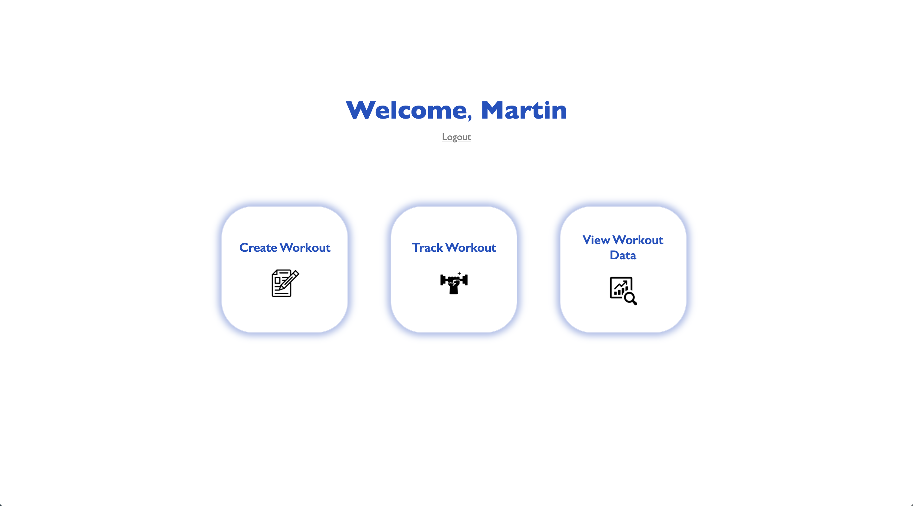
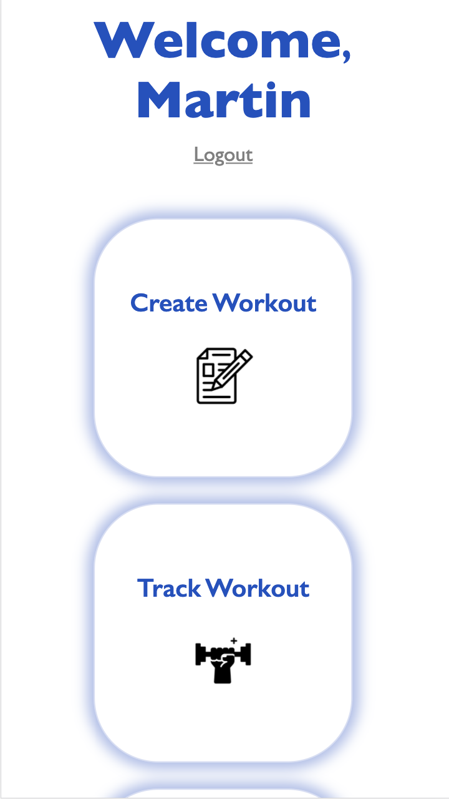
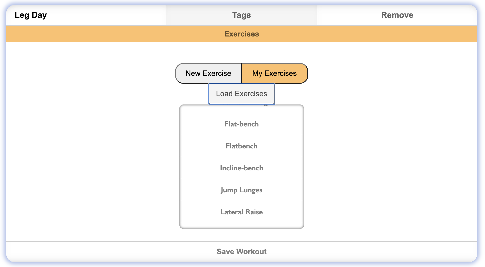
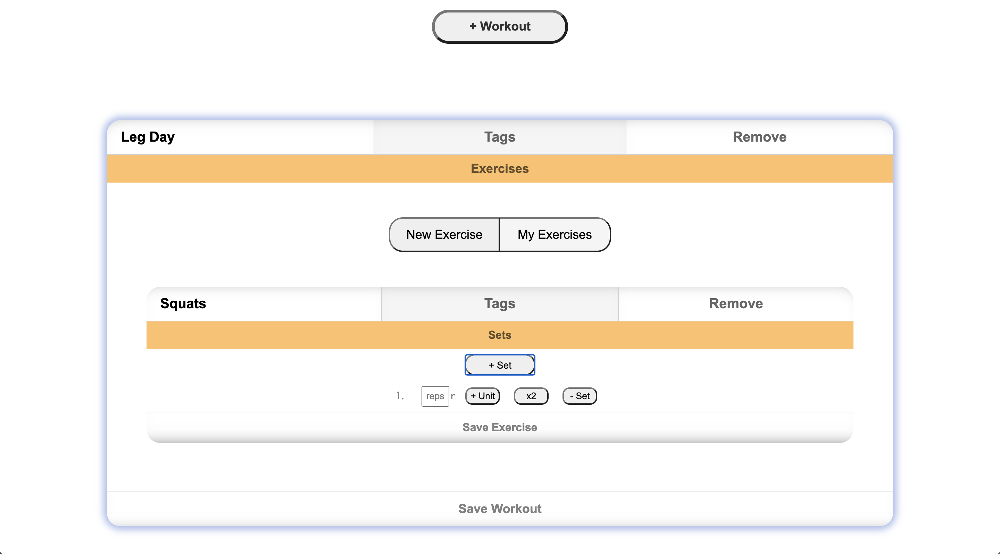
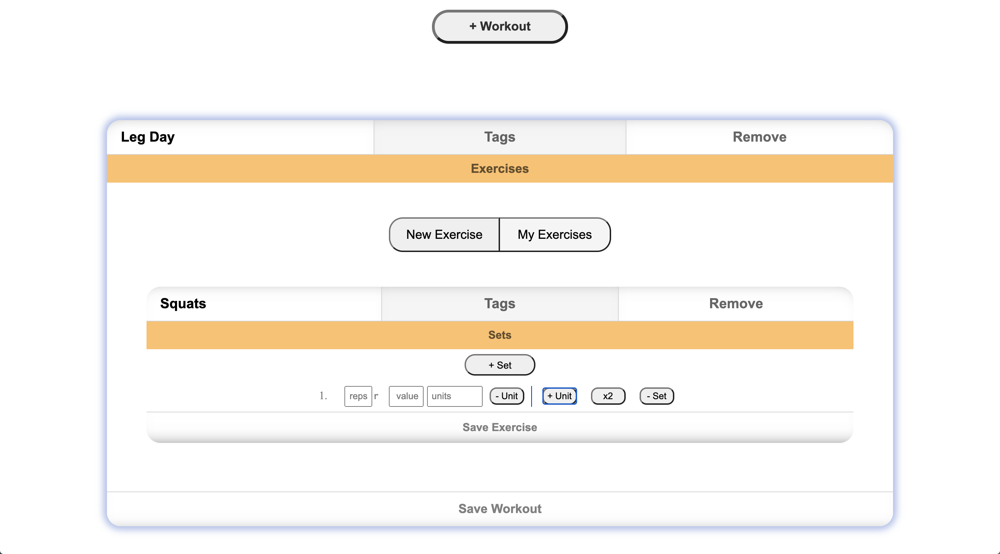
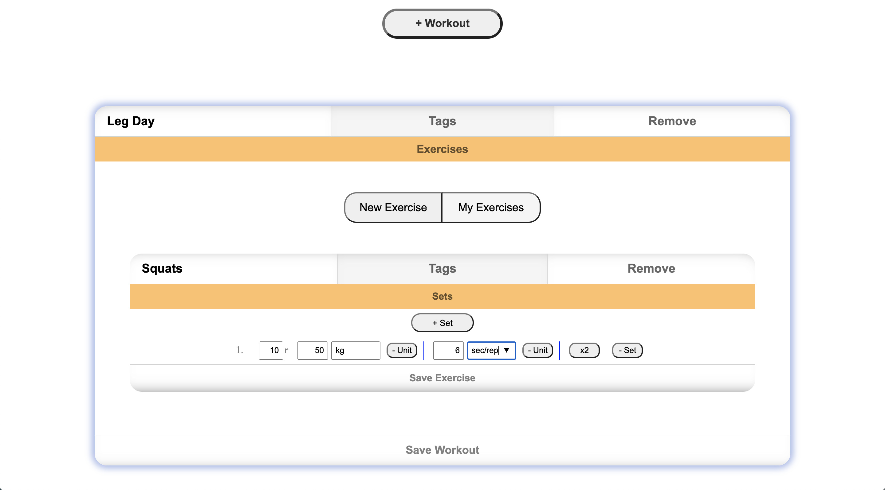
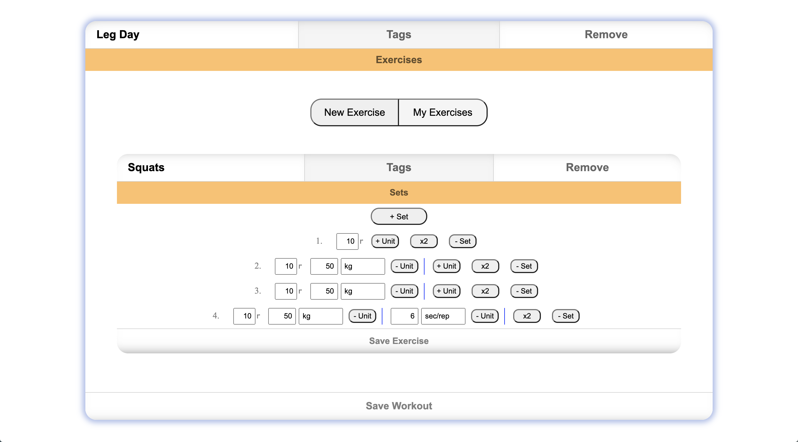
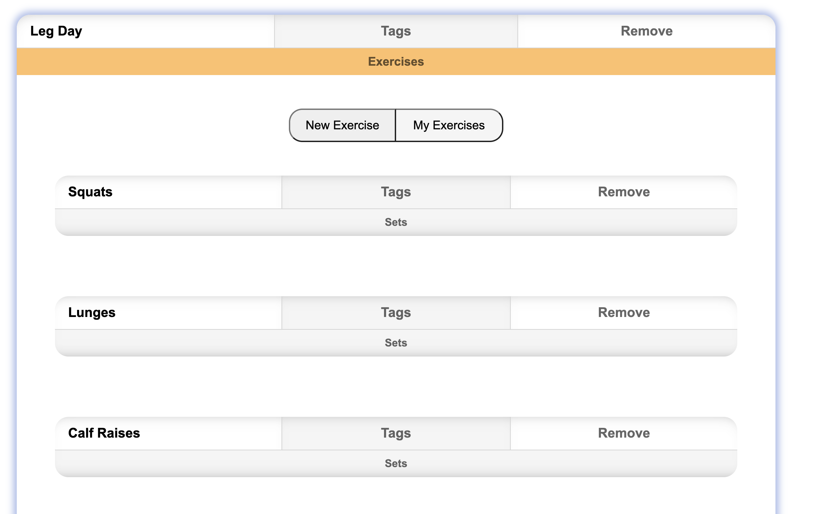

# TrackerX

(work in progress)
A workout tracker that allows the user to create workouts, track them, and view the tracked data.

-   Sections
    -   Features
    -   [Tech Stack](#tech-stack)
    -   [Screenshots](#screenshots)

## Features

-   Customizable units of measurement for sets (e.g. user can track seconds/repition, or seconds/eccentric-movement)
-   Mobile compatible

#### Create Workout page

-   Link to home screen
-   "+ Workout" button generates an empty "Workout"

#### Track Workout page

-   Link to home screen
-   "Choose Workout" button - shows a list of the user's saved workouts. clicking one generates a "Workout" with the saved workout data prefilled in all the input fields

#### View Workout Data page

-   Shows table containing tracked workout data
-   (currently working on integrating) Data visualisation: visualize tracked data in meaningful ways

#### A "Workout"

-   A "Workout" contains the following sections:
    -   workout name - input field
    -   collapsible "tags" section for adding tags (e.g. bodyweight, home-workout, etc.) - div with user-generated input fields
    -   "Remove workout" button - removes current "Workout" from page
    -   "Exercises" button that shows/hides the 'exercises' section
-   Collapsible "Exercises" section contains:
    -   Buttons
        -   "New Exercise" - generates html for inputting exercise information
        -   "My Exercises" - shows list of user's saved exercises. clicking on an exercise generates the exercise with all input fields prefilled with the saved data that corresponds to chosen exercise
        -   "Save Workout"/"Track Workout" - saves workout information / tracks the inputted workout data (depending on whether you are on "Create Workout" or "Track Workout" page)
    -   Exercises
-   An "Exercise" contains the following sections:
    -   exercise name - input field
    -   collapsible "tags" section - mirrors workout tags
    -   "Remove Exercise" button - Removes exercise from workout (does not delete exercise data)
    -   "Sets" button that shows/hides the 'Sets' section
    -   'Sets' section:
        -   "Save Exercise" / "Update Exercise" button - saves / updates exercise data provided by user (depending on whether you are on "Create Workout" or "Track Workout" page)
        -   "+ Set" button - generates html for inputting 'set' information (no limit on number of sets)
        -   Each set contains:
            -   set number
            -   Reps input field - the number of repitions provided by the user for that set
            -   "+ unit" button - generates html (for that set) with input fields for adding units of measurement
            -   "x2" button - duplicates the chosen set with all user-inputted data (reps, units)
            -   "- Set" button - deletes the set
            -   each 'unit' (max 2 units/set) contains:
                -   "value" - input field where user can provide a value (e.g. 20)
                -   "units" - input field where user can provide a unit of measurement (e.g. Kg)
                    -   has dropdown menu with pre-set units to choose from (e.g. kg, pounds, seconds, etc.)
                    -   user can create their own unit of measurement (e.g. seconds/last-repitition)
                -   "- Unit" button - deletes the chosen unit of measurement

#### Home page

-   Links to
    -   Create Workout page
    -   Track Workout page
    -   View Workout Data page

## Tech Stack

-   JavaScript
    -   React
    -   Node.js
    -   Express
-   Amazon Web Services - for sending password-reset email
-   PostgreSQL - for storing
    -   user info (first- last name, email, hashed password)
    -   workout info (workout name, tags, exercises)
    -   exercise info (exercise name, tags, set data (number of sets, reps/set, units/set))
    -   tracked workout data (contains wokrout and exercise data for the date & time of submission)
-   HTML
-   CSS

## Screenshots

### Home Page

##### Desktop

<!-- ##### Mobile

 -->

### Create Worout Page

#### A "Workout"

-   Workout Tags
    

-   "Exercises" Section
    

    -   My Exercises
        
    -   Exercise
        
    -   Exercise Tags
        
    -   Sets Section
        
    -   Set

        

        -   Set Units
            

        -   Entering set-data
            

        -   Adding a second unit of measurement
            

        -   Multiple Sets
            

    -   Multiple exercises
        
